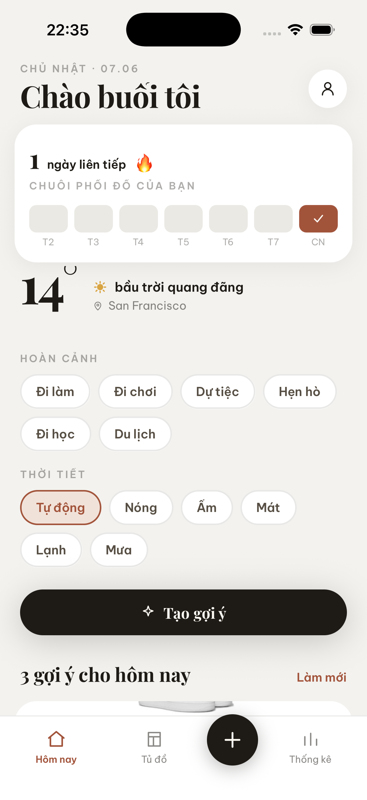
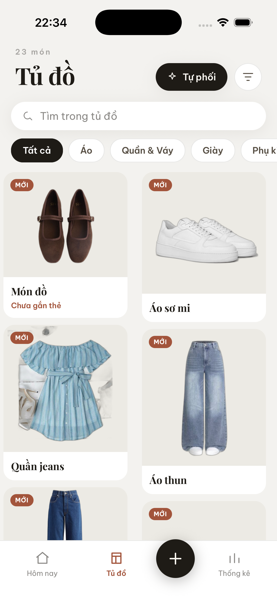
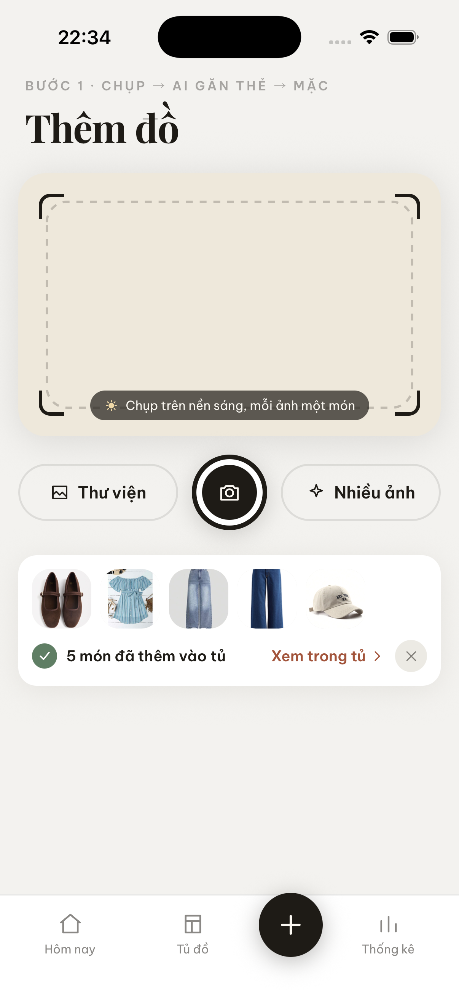
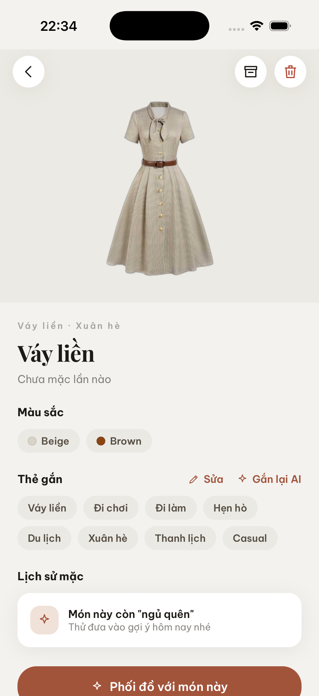
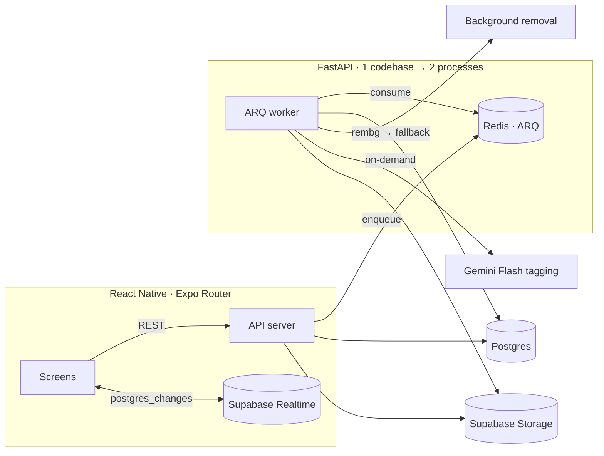

# AwesomeCloset

> Tủ đồ số AI-first cho người Việt — chụp ảnh món đồ → tách nền + gắn thẻ → gợi ý outfit theo thời tiết & dịp.


<p align="center">
  
  
  
  
</p>

## The Problem

Người dùng có cả tủ đầy đồ nhưng thường "không biết mặc gì" mỗi sáng, và mua trùng vì không nắm được mình đang có gì. AwesomeCloset số hoá tủ đồ: chụp một ảnh là có món đã tách nền + gắn thẻ, và gợi ý outfit hằng ngày theo thời tiết & dịp.

Trọng tâm kỹ thuật nằm ở backend: biến một tấm ảnh thành dữ liệu có cấu trúc, tức là chạy AI (tách nền + nhận diện) **bất đồng bộ, đáng tin cậy, và chi phí kiểm soát được** trên hạ tầng nhỏ (worker 1GB RAM, AI free-tier). README này tập trung vào phần đó.

---

## Features — core loop

1. **Chụp & Upload** — camera in-app hoặc batch từ gallery; xin quyền khi bắt đầu upload.
2. **Tách nền** — `rembg` (u2netp, local) + fallback Remove.bg; output PNG trong suốt + thumbnail.
3. **Gắn thẻ** — Gemini Flash sinh `type / colors / style / season / occasion` (on-demand), hoặc gắn thủ công.
4. **Tủ đồ** — grid, filter/search theo thẻ, badge "MỚI" / "Chưa gắn thẻ", soft-delete + archive.
5. **Gợi ý outfit** — mở khoá khi đủ 15 món đã gắn thẻ; Gemini phối đồ theo thời tiết (OpenWeatherMap) + dịp, kèm collage + lý do.
6. **Analytics** — màu mặc nhiều, đồ chưa mặc, lịch sử outfit (tính server-side).

---

## Architecture



- **Hai process, một codebase**: `backend.main:app` (API) và `backend.workers.main.WorkerSettings` (ARQ worker) deploy riêng nhưng dùng chung code/model.
- **Upload trả `202` ngay** → worker xử lý nền: `pending → removing_bg → ready`. Mobile theo dõi qua Supabase Realtime trên `clothing_items`.
- **Hai chiều trạng thái độc lập**: `processing_status` (pipeline tách nền) ⊥ `tag_status` (gắn thẻ on-demand).
- **Auth**: JWT ES256 qua JWKS, cache theo `kid`, auto-refresh khi key xoay.

---

## API Design & patterns

**23 REST endpoint** trên 4 feature router (`items` 9 · `outfits` 8 · `analytics` 4 · `suggest` 2), tất cả dưới `/api/*`.

**Layering nhất quán mỗi feature — `Router → Service → Repository → Model`:**
- **Router** — ranh giới HTTP, validate schema, *composition root* (ráp dependency trong `_make_service`). Không chứa business logic.
- **Service** — business logic, sở hữu *transaction boundary* (`async with transaction(...)`), raise `AppException`; không biết về HTTP.
- **Repository** — mọi truy vấn DB, không lộ session ra ngoài.

**Dependency Inversion cho external client** (SOLID — chữ D, hiện thực qua DI): service/worker phụ thuộc **ABC** (`StorageClient`, `BackgroundRemovalClient`, `GeminiClient`), implementation cụ thể (`SupabaseStorageClient`, `RembgClient`, `GeminiFlashClient`) inject từ router. Kết quả: swap implementation + mock ABC trong unit test, không cần DB. *(Repository inject dạng concrete — chỉ một impl Postgres nên mock thẳng, không đặt thêm interface.)*

**Quy ước REST:**
- Resource URL + verb chuẩn; **PATCH** cho partial update (không PUT); status code `202` (job async), `204` (delete), `403/404/409`.
- Thao tác không map gọn vào CRUD dùng **action endpoint** (`/archive`, `/retry`, `/tag`, `/save`, `/wear`) — REST thực dụng, không HATEOAS.
- Gate ở **service layer** (`403 CLOSET_NOT_READY`); `AppException → JSON` qua global handler; rate-limit trên endpoint AI (`/tag` 100/ngày, `/suggest/outfit` 10/ngày); DI qua `Annotated` alias (`CurrentUserDep`, `SessionDep`, `ServiceDep`).

**Ranh giới client ↔ hạ tầng (hybrid):** mọi đọc/ghi nghiệp vụ đi qua FastAPI (REST/JSON). Auth, realtime (websocket `postgres_changes`), và ảnh (signed URL) đi **thẳng Supabase** — hạ tầng commodity giao cho BaaS thay vì proxy lại. Hệ quả thiết kế: **RLS bảo vệ kênh realtime** (client subscribe nhưng RLS lọc row được nhận), và signed URL có TTL cần quản lý.

---

## Engineering Highlights

Năm vấn đề backend chính và hướng giải. Chi tiết đầy đủ ở [`docs/lessons-learned.md`](docs/lessons-learned.md).

### 1. Pipeline AI bất đồng bộ — phản hồi tức thì, chi phí kiểm soát

Upload trả `202 Accepted` ngay, đẩy việc nặng sang ARQ worker; mobile theo dõi tiến độ qua Supabase Realtime thay vì polling. Hai bước AI có hồ sơ chi phí trái ngược nên xử lý khác nhau: tách nền chạy `rembg` local (free, không giới hạn) → **auto**; gắn thẻ gọi Gemini (tốn phí, dính rate-limit) → **on-demand** (`POST /items/{id}/tag`).

Để tách hai luồng, dùng **hai chiều trạng thái độc lập** — `processing_status` (pipeline) ⊥ `tag_status` (gắn thẻ), bất biến `tagged ⟺ có type`. Một lần gắn thẻ lỗi chỉ set `tag_failed`, không làm món đồ "hỏng" (vẫn `ready`, dùng được). Việc chuyển auto → on-demand cũng loại bỏ vòng auto-retry từng làm cạn quota Gemini. [→ chi tiết](docs/lessons-learned.md#architecture--deploys)

### 2. Giữ worker dưới 1GB RAM

Worker bị OOM-kill trên Railway (1GB) khi upload nhiều ảnh — RAM tăng dần qua từng job và không trả lại. Bóc tầng: serialize job (`max_jobs=1`) → downscale ảnh đầu vào → đổi model `u2net → u2netp` (~176MB → ~5MB). Nguyên nhân cuối là **CPU memory arena của onnxruntime** giữ bộ nhớ giữa các lần inference; tắt `enable_cpu_mem_arena` + `intra_op_num_threads=1` cho profile RAM phẳng, hết OOM. [→ chi tiết](docs/lessons-learned.md#workers--background-jobs-arq)

### 3. Background jobs idempotent + tự phục hồi

Worker có thể chết/restart bất kỳ lúc nào nên job phải an toàn khi chạy lại. Mỗi job dùng **deterministic id** (`process_item:{id}`) để dedup giữa upload / retry / recovery; đặt **`keep_result=0`** vì result-key mặc-định-1h của ARQ âm thầm chặn re-enqueue cùng id (từng làm item kẹt `pending`). Item kẹt được **cron orphan-recovery mỗi 5 phút** phục hồi, kèm terminal state để vòng quét không lặp vô hạn. [→ chi tiết](docs/lessons-learned.md#deterministic-job_id--arq-keep_result-1h--item-kẹt-pending)

### 4. Gợi ý outfit — AI chạy đồng bộ trong request, có kiểm soát

Khác với ingest (đẩy sang worker), gợi ý là tác vụ user chờ kết quả ngay nên `POST /api/suggest/outfit` chạy **đồng bộ trong request**, bọc bằng **timeout + rate-limit (10/ngày) + cache theo ngày**. Cache key `(user_id, ngày, context_hash)` với `context_hash = hash(item_ids + thời tiết + dịp)` → cùng bối cảnh trong ngày không gọi lại Gemini; outfit đã cache bị xoá thì tự regenerate. `item_id` Gemini trả về được **validate lại với closet** (bỏ id không tồn tại), và outfit tạo **tuần tự** vì `AsyncSession` dùng chung không an toàn concurrent. [→ chi tiết](docs/SPEC.md)

### 5. Test trên Postgres thật, không phải SQLite

Integration test chạy **Testcontainers Postgres + migration thật** (chỉ mock AI/storage API) để cover `JSONB`, array, enum, UUID — những thứ SQLite mô phỏng sai. Unit test mock repo và ABC client ngoài nên test service không cần DB. Cả hai tầng chạy trong CI mỗi PR trước khi merge. [→ chi tiết](docs/lessons-learned.md)

---

## Tech Stack

| Lớp | Công nghệ | Lý do chọn |
|---|---|---|
| Mobile | React Native + Expo Router (SDK 56) | File-based routing, dev-client cho thiết bị thật, design-token system |
| API | FastAPI (Python 3.12, async) | Async I/O cho pipeline AI, type-safe với Pydantic/SQLModel |
| DB / Auth / Storage | Supabase (Postgres, Auth, Storage, Realtime) | Một nền tảng: RLS, JWT, signed URL, realtime trên bảng |
| Background jobs | ARQ + Redis | Job bất đồng bộ nhẹ, cron, retry/defer |
| AI | Gemini Flash multimodal · rembg (u2netp) | Nhận diện ảnh + tách nền local |
| Test | pytest + Testcontainers | Integration trên Postgres thật, không SQLite |

---

## Project Structure

```
backend/
  <feature>/{models,repository,service,router,schemas}.py   # Router → Service → Repository → Model
  core/                # config, auth (JWKS ES256), database, storage, dependencies
  workers/             # ARQ: process_item (tách nền) + tag_item (gắn thẻ on-demand)
mobile/
  app/                 # Expo Router (route = file): (auth) (tabs) item/ outfit/ ...
  components/  hooks/  lib/   # UI primitives, useSession/useCloset/useRealtimeItem, api + theme tokens
supabase/migrations/   # SQL: enums → tables → RLS → storage → realtime → tag_status
docs/                  # SPEC · PLAN · lessons-learned · architecture-patterns · DEPLOY
```

Quy ước: import một chiều `feature/* → core/*` (core không import feature). Service sở hữu transaction; Repository giữ mọi query; external client có ABC để mock trong test.

---

## Getting Started

**Backend**
```bash
make install        # uv sync --all-groups
make redis          # Redis qua docker compose
make dev            # FastAPI trên :8000 (--reload)
make worker         # ARQ worker (process riêng)
make test           # pytest (unit + integration)
```
`.env` cần: `DATABASE_URL`, `SUPABASE_URL`, `SUPABASE_ANON_KEY`, `SUPABASE_SERVICE_ROLE_KEY`, `GEMINI_API_KEY`, `SECRET_KEY`, `OPENWEATHERMAP_API_KEY` (tuỳ chọn: `REDIS_URL`, `REMOVEBG_API_KEY`).

**Mobile** (Expo SDK 56 — Expo Go không hỗ trợ, dùng dev client)
```bash
cd mobile
npm install
cp .env.local.example .env.local   # EXPO_PUBLIC_SUPABASE_URL / _ANON_KEY / _API_URL
npx expo run:ios                    # build dev client (lần đầu ~10')
```

---

## Testing

- **Unit** (`test_service.py`): mock repo + client ngoài, không cần DB.
- **Integration** (`test_integration.py`): Testcontainers Postgres, chạy migration thật (bỏ RLS/storage/realtime), chỉ mock AI/storage API. Không dùng SQLite — để cover `JSONB`, array, UUID, hành vi Postgres.

```bash
make test-unit      # pytest -k "not integration"
make test-int       # pytest -k "integration"
cd mobile && npm run ts   # TypeScript check
```

---

## Status & Docs

Core loop end-to-end và split-flow gắn thẻ on-demand đã hoàn tất (#40–43). Còn lại: push notifications, CD, thùng rác/undo, dọn storage tự động.

- [`docs/SPEC.md`](docs/SPEC.md) — đặc tả sản phẩm, data model, API.
- [`docs/PLAN.md`](docs/PLAN.md) — task plan + mục Amendments (post-MVP).
- [`docs/lessons-learned.md`](docs/lessons-learned.md) — ghi chú kỹ thuật.
- [`docs/architecture-patterns.md`](docs/architecture-patterns.md) · [`docs/DEPLOY.md`](docs/DEPLOY.md).
